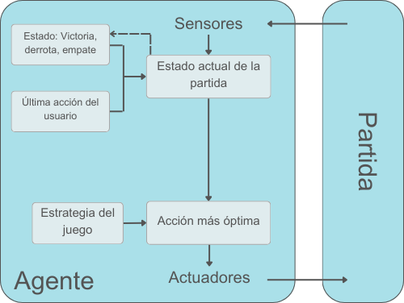

Project-RPS
===========

* [Propuesta](#propuesta)
* [Especificación del entorno](#especificación-del-entorno)
* [Identificación del tipo de agente y estructura](#identificación-del-tipo-de-agente-y-estructura)
* [Proceso de instalación](#proceso-de-instalación)

## Propuesta
Este proyecto consiste en crear un programa que ejecute el popular juego de piedra papel o tijera (será referenciado como RPS) y sea capaz de acumular la mayoría de victorias contra un usuario. Si se tratara de un juego de azar la probabilidad de ganar sería una de tres, pero, consciente o inconscientemente, siempre se sigue una estrategia. Una de estas mismas es la que se pretende descifrar en la propuesta siguiente.

En el contenido de este proyecto se encuentra una tabla resumen de las características del entorno de tareas, explicando y argumentando cada sección; un esquema de la estructura del agente escogido y su relación con el código; una guía para la instalación de la aplicación; y por último el código python empleado para el desarrollo del proyecto ([carpeta RPS](/src/RPS)).
## Especificación del entorno

Entorno | Observable | Agentes | Determinista | Episódico | Estático | Discreto | Conocido | Adverso |
:---: | :---: | :---: | :---: | :---: | :---: | :---: | :---: | :---: |
 RPS | Parcial | Multi-agente | Estocástico | Secuencial | Estático |  Discreto |  Conocido | Adverso |

**· Parcialmente visible:**
	No todos los factores que influyen en el resultado son visibles en el momento de tomar la decisión. El agente no sabe (con exactitud) qué opción va a escoger el usuario cuando tiene que decidir qué sacar.

**· Multi-agente:**
	El número de participantes para que el juego funcione es mayor a uno, en este caso concreto es de dos: la máquina y el usuario.

**· Estocástico:**
	Con los datos que se tienen el resultado es no predecible. Como en cada ronda el ganador es incierto no se puede tener un conocimiento fundado del fin de la partida.

**· Secuencial:**
	Las acciones presentes afectan a las futuras. Según la programación del agente (véase apartado [Identificación del tipo de agente y estructura](#identificación-del-tipo-de-agente-y-estructura)), este almacena información del rendimiento del usuario y actúa en base a ella en las próximas partidas.

**· Estático:**
	El entorno no cambia mientras se está tomando la decisión, cambia inmediatamente después, en el desenlace de la ronda.

**· Discreto:**
	Las posibles acciones y resultados son concretos y contables. Existen tres opciones (piedra, papel o tijera) y nueve resultados (el agente tiene tres opciones y el usuario tiene tres opciones, entonces 3x3=9). En el caso de la ampliación RPSLS ambos tienen cinco opciones (piedra, papel, tijera, lagarto o Spock), por lo tanto veinticinco desenlaces posibles (5x5=25).

**· Conocido:**
	El agente domina las reglas del juego y es capaz de aplicarlas sin dificultad.

**· Adverso:**
	El objetivo del agente es directamente contrario al del usuario. El agente es recompensado cuando gana o, que en este caso es lo mismo, cuando el usuario pierde.

## Identificación del tipo de agente y estructura
El **agente reflexivo basado en modelos** conserva un estado interno del mundo con un historial temporal de la parte del mundo que no se puede observar. Esta característica hace al agente eficaz ante entornos parcialmente observables, como es el caso.

En términos del RPS (o RPSLS, ya que la estrategia a seguir es la misma), el mundo (la partida) puede variar entre tres estados: victoria, derrota o empate (en el código, la variable `game_result` ). La parte no observable sería lo que va a sacar el usuario a continuación, así que esta clase de agente puede almacenar un pequeño historial del desarrollo de las partidas anteriores, en concreto de la inmediatamente anterior (la variable `user_action`). Estos dos factores son los que el agente tiene en cuenta al definir el estado del mundo.

Las reglas a seguir asignadas al agente (función `get_computer_action`) son simples pero efectivas:
1. Si no hay registrada ninguna partida anterior, el agente empieza sacando papel.
2. Si el agente ha ganado la partida anterior, elige lo último que sacó el usuario.
3. Si el agente ha perdido la partida anterior, elige la opción que ninguno sacó. (En el caso de RPSLS, una aleatoria)
4. Si se da un empate, elige de manera aleatoria.

La toma de decisión se basa en el estado actual de la partida y en los patrones dados al agente.

## Proceso de instalación